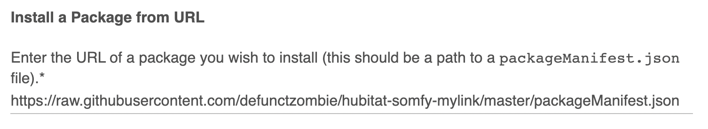

# Hubitat Somfy MyLink Integration

Device integration for Somfy devices via a MyLink hub.

## Devices

* Hub
* Shade

## Installation

[Hubitat Package Manager](https://github.com/dcmeglio/hubitat-packagemanager) is the recommended installation method.

You can install this package using the "From a URL" install option.


On the next screen, enter the following url:

```
https://raw.githubusercontent.com/defunctzombie/hubitat-somfy-mylink/master/packageManifest.json
```



Then click `next`.

## Prior Art

This work continues from the integration support in these repos:

* https://github.com/scelfo/hubitat-somfy-mylink
* https://github.com/bendews/smartthings-somfy-mylink
